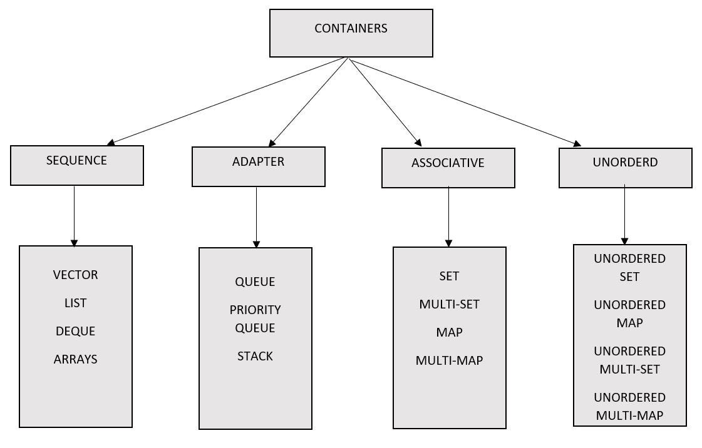
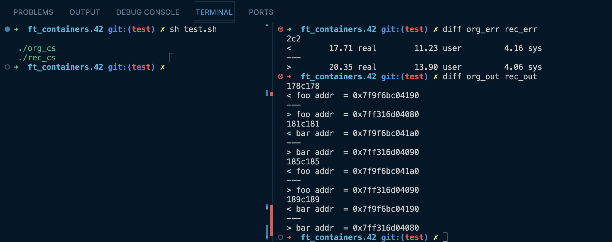
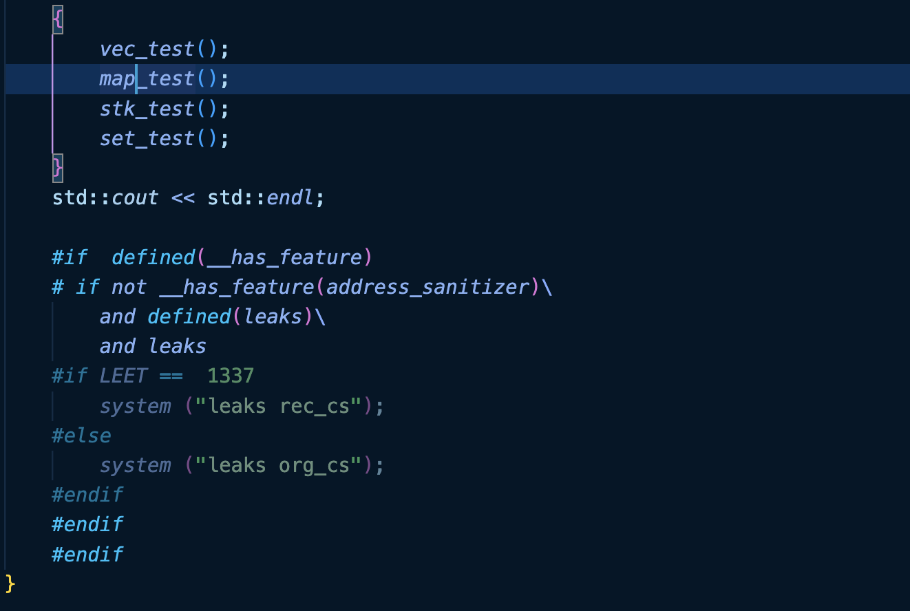
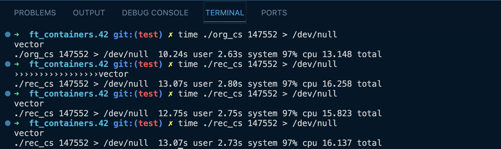

# ft_container

## Project Description

The "ft_container" project is a C++98 standard-compliant re-implementation of essential C++ containers such as vector, map, stack, and optionally set using a Red-Black tree.

## Features

- Custom implementations of vector, map, and stack adhering to C++98.
- In-depth understanding of container design and memory management.
- Performance and functionality comparisons with STL containers.

## Project Structure

- `ft_vector`: Custom vector implementation
- `ft_map`: Custom map implementation using a Red-Black tree
- `ft_stack`: Custom stack implementation
- `ft_set` (bonus): Custom set implementation using a Red-Black tree

## Requirements and Constraints

- Adherence to C++98 standard.
- Avoidance of memory leakage.
- Custom implementations without using STL containers.
- ...

## Testing

## Performance 

